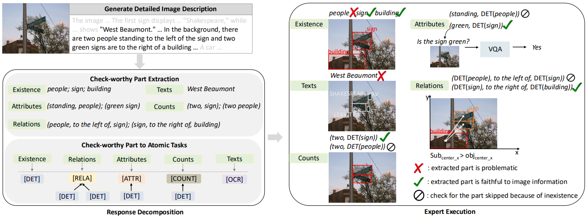

# Implementation for [Decompose and Leverage Preferences from Expert Models for Improving Trustworthiness of MLLMs](https://arxiv.org/pdf/2411.13697)

## Overview

<p align="center">
  
</p>

We proposed a decomposable framework with expert models, **DecompGen**, for automatically generating preference data (**DGPref**) for enhancing trustworthiness of MLLMs. This repositories contain both the code for atomatic preference data collection and the code for direct preference optimization (DPO) of MLLMs based on the constructed preference dataset, DGPref.

For DecompGen, it consists of two steps: 1) response decomposition and 2) expert execution. In response decomposition, it convert a lengthy and composition MLLM response into atomic verification tasks. In the expert execution step, atomic tasks will be assigned to approporiate expert models to generate fine-grained assessments. The assessments are leveraged for preference dataset construction. 

Below, we elaborate the data used for preference dataset contruction and model evaluation, our experiment settings, the pipeline for constructing DGPref (i.e., preference data collection) and how to leverage DGPref for DPO:

## Content
- [Dataset Preparation](#dataset-preparation)
- [Experiment Setting](#experiment-setting)
- [Preference Data Generation](#preference-data-generation)
- [Model Training](#model-training)
  
## Dataset Preparation
In order to replicate the code and performance, you need to prepare two-fold of data: 1) data for generating preference data; and 2) data for evaluation.
### Data for Preference Data Generation
Our code is compatible with any images (i.e., you can generate raw detailed descriptions for any images and generate preference data with our code). Specifically, in our implementation, we use the [Visual Genome images](https://homes.cs.washington.edu/~ranjay/visualgenome/index.html), as the main image source. The Visual Genome dataset is denoted as vsg in our implementation. You can download the Visual Genome images with the script below:
```
wget https://cs.stanford.edu/people/rak248/VG_100K_2/images.zip -P images_part_1
wget https://cs.stanford.edu/people/rak248/VG_100K_2/images2.zip -P images_part_2
```
Scene graphs for Visual Genome images are available [here](https://cs.stanford.edu/people/dorarad/gqa/download.html), which we denoted as train_sceneGraphs/val_sceneGraphs.

Theoritically, we can use any images for preference data generation. An alternative option we considered in our ablations is to use COCO-2014 training images for preference data generation. The dataset can be downloaded with the script:
```
wget images.cocodatsaet.org/zips/train2014.zip
```
The COCO dataset is denoted as coco in our implementation.

### Data for Evaluation
We use three benchmarks as main evaluation datasets:
1. ObjectHal Bench (which we denoted with objhal in our implementation). We follow previous works to use the exact 300 examples in the original ObjectHal bench for evaluation. You can access the evaluation dataset (as well as the input prompts) [here](https://github.com/RLHF-V/RLAIF-V/blob/main/eval/data/obj_halbench_300_with_image.jsonl) ObjectHal dataset uses images from COCO-2014 (val split) You can download the images via [this link](https://cocodataset.org/#download) Optionally, you can use the script below for dowloading:
```bash
wget http://images.cocodataset.org/annotations/annotations_trainval2014.zip
unzip annotations_trainval2014.zip
```
2. MMHal Bench (which we denoted with mmhal in our implementation). You can download the data [here](https://github.com/RLHF-V/RLAIF-V/blob/main/eval/data/mmhal-bench_answer_template.json). Images for MMHal dataset are availabel in [this link](https://drive.google.com/file/d/1mQyAbeGgRyiVV6qjVkUI1uY_g9E-bDTH/view0).
3. AMBER (which we denoted with amber in our implementation). You can access all information for AMBER via [this link](https://github.com/junyangwang0410/AMBER) The data is also available via the link.

**Be careful!!!! After downloading all data, you still need to update the path in our implementation to your file path.**

## Experiment Setting
Essential requirements are listed in [essential_requirement.txt](https://github.com/abril4416/DGPref/blob/main/essential_requirement.txt), the versions of which matter. For other required packages, please see the import command in each file. More detailed experiment setup can be found in Appendix I in our [paper](https://arxiv.org/pdf/2411.13697).

## Preference Data Generation
1. Generate detailed image descriptions from base MMLMs (controlled by MODEL_NAME) without any further training; Execute:
   ```
   python Fine_Grained_Alignment/src/raw_caption_gen.py --MODEL_NAME "llava-hf/llava-1.5-7b-hf" --GEN_DATASETS "vsg"
   ```
   Please also check what dataset you would like to generate raw captions for (You need to check *val_dataset_names* in the [code](https://github.com/abril4416/DGPref/blob/main/Fine_Grained_Alignment/src/raw_caption_gen.py) for details), controlled by GEN_DATASETS.
   You can also directly use our provided detailed descriptions [vsg.pkl](https://drive.google.com/drive/folders/1rCZuOoBIQCAFaMvX8ujYYFG15k5iKvOZ?usp=sharing).
3. Decompose length and compositional responses from base MMLMs accoding to different aspects (object, attributes, relations, etc). The decomposition is conducted with in-context learning by providing a few demonstrations. The demonstration templates can be found [here](https://github.com/abril4416/DGPref/tree/main/Decomp_Gen_Cap/templates_llama); Execute:
   ```
   python Decomp_Gen_Cap/src/meta_llama3_extract.py --GQA_PATH [YOUR_FILE_PATH] --target_file [YOU_GENERATED_CAPTION_PATH]
   ```
   The decomposed results can be found in [decomp_results_llava_vsg_0.25/all_vsg_llama3.pkl](https://drive.google.com/drive/folders/1rCZuOoBIQCAFaMvX8ujYYFG15k5iKvOZ?usp=sharing).
4. Assign decomposed results to proper experts for evaluation and generate expert scores; Execute:
   ```
   python Decomp_Gen_Cap/src/program_to_tool.py
   ```
   Make sure your paths are set corretly.
   The execution results can be found in [decomp_results_llava_vsg_0.25/expert_check_scores.pkl](https://drive.google.com/drive/folders/1rCZuOoBIQCAFaMvX8ujYYFG15k5iKvOZ?usp=sharing).
6. Use the expert scores to generate paired preferred and rejected data; Execute:
   ```
   python Fine_Grained_Alignment/src/pref_data_gen.py --CONSIDERED_ASPECTS [YOUR_CONCERNED_ASPECTS]  --MODEL_NAME [YOUR_MODEL] --DATA_NAME "[VSG or COCO or Other Image Sources] --raw_gen_file [YOU_GENERATED_CAPTION_PATH] --expert_score_file [EXPERT_EXECUTION_RESULT]
   ```
   As detailed image descriptions focus on different aspects (e.g, object, attributes, relations, etc.). The preference data can also be generated with certain aspects (i.e., prefer captions better at certain aspects). You can set the aspects to focus on with *--CONSIDERED_ASPECTS*. Meanwhile,the scoring of each caption can be a summation of scores from expert evaluators or averaging over scores of expert evaluators (with *--AVG_ADV_SCORES*).
   Instead of generating yourselves, we provide the collected data in [vsg_llava-1.5-7b-hf](https://github.com/abril4416/DGPref/tree/main/Fine_Grained_Alignment/pos_neg_pair_gen/vsg_llava-1.5-7b-hf) and [vsg_Qwen-VL-Chat](https://github.com/abril4416/DGPref/tree/main/Fine_Grained_Alignment/pos_neg_pair_gen/vsg_Qwen-VL-Chat), for LLaVA and QWen-VL-Chat, respectively.
## Model Training
After generating the preference data, you can conduct direct preference optimization (DPO) of MLLMs. To conduct DPO, the log probabilities of captions are also needed as the reference log probability. You need to execute:
```
python Fine_Grained_Alignment/src/logp_gen_for_pairs.py --MODEL_NAME [YOUR_MODEL] --CONSIDERED_ASPECTS [YOUR_CONCERNED_ASPECTS] --DATA_NAME "[VSG or COCO or Other Image Sources]
```
for generating the log probabilities.
We provide the log probability of both LLaVA and QWen-VL-Chat [here](https://drive.google.com/drive/folders/1rCZuOoBIQCAFaMvX8ujYYFG15k5iKvOZ?usp=sharing).
Then, DPO training for LLaVA can be conducted with:
```
python Fine_Grained_Alignment/src/main.py --micro_batch_size 4 --gen_step 4500 --gen_start 9000 --eval_step 4500 --lora_r 32 --lora_alpha 32 --learning_rate 5e-6 --num_epochs 2 --batch_size 8  --CONSIDERED_ASPECTS "object,count,attribute,spatial,scale,text" --HAL_DATASETS "objhal,mmhal,amber"  --infer_batch_size 12 --MODEL_NAME "llava-hf/llava-1.5-7b-hf" --temperature 0.0 
```
DPO training for Qwen-VL-Chat can be conducted with:
```
python Fine_Grained_Alignment/src/main.py --micro_batch_size 1 --gen_step 2400 --gen_start 4800 --eval_step 2400 --lora_r 32 --lora_alpha 32 --learning_rate 7e-6 --num_epochs 1 --batch_size 8  --CONSIDERED_ASPECTS "object,object,count,attribute,spatial,scale,text" --HAL_DATASETS "objhal,mmhal,amber"  --infer_batch_size 12 --MODEL_NAME "Qwen/Qwen-VL-Chat" --temperature 0.0
```

## Provided Data
- You can refer to this link to our [Google Drive](https://drive.google.com/drive/folders/1rCZuOoBIQCAFaMvX8ujYYFG15k5iKvOZ?usp=sharing) shared files to avoid generating data (base MLLM generated detailed captions, expert model execution results, log probability of reference MLLMs).
- We provide log files of training, generation results, and GPT-4 evaluation results in the [results folder](https://github.com/abril4416/DGPref/tree/main/Fine_Grained_Alignment/results)

## Tips
- We highly recommend using the original code for [LLaVA](https://github.com/haotian-liu/LLaVA), though we used the huggingface implementation in our code. We noticed the image processor of LLaVA provided by huggingface is not the same as its original implementation and sufferred from images with varying resolution (especially those with high resolutions).
- Please make sure the paths of files (e.g., VG images) are set correctly to run our model.
- **You can always use the DEBUG mode (set --DEBUG True) for easier debugging~**
- The evaluation of MMHal is based on GPT-4. You can find the evaluation code [here](https://github.com/abril4416/DGPref/blob/main/Fine_Grained_Alignment/src/gpt_utils.py).

## Citations
If you find our model/code/data/paper helpful, please consider cite our papers and star us！
```bibtex
@misc{cao2024decomposeleveragepreferencesexpert,
      title={Decompose and Leverage Preferences from Expert Models for Improving Trustworthiness of MLLMs}, 
      author={Rui Cao and Yuming Jiang and Michael Schlichtkrull and Andreas Vlachos},
      year={2024},
      eprint={2411.13697},
      archivePrefix={arXiv},
      primaryClass={cs.CV},
      url={https://arxiv.org/abs/2411.13697}, 
}
```
We benefit a lot from the excellent work as wel as its code from:
```bibtex
@article{yu2024rlaifv,
  title={RLAIF-V: Aligning MLLMs through Open-Source AI Feedback for Super GPT-4V Trustworthiness},
  author={Yu, Tianyu and Zhang, Haoye and Yao, Yuan and Dang, Yunkai and Chen, Da and Lu, Xiaoman and Cui, Ganqu and He, Taiwen and Liu, Zhiyuan and Chua, Tat-Seng and Sun, Maosong},
  journal={arXiv preprint arXiv:2405.17220},
  year={2024},
}
```
